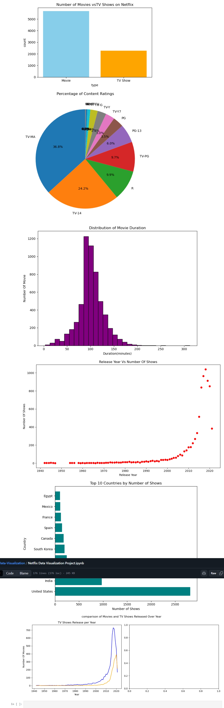

📊 Netflix Data Visualization Project

This project provides an in-depth data visualization analysis of Netflix content using Matplotlib and Pandas. The goal is to explore trends, patterns, and insights from Netflix’s dataset by creating meaningful visual representations.

🔍 Project Overview

In this project, we visualize different aspects of Netflix content such as:
✅ Number of Movies vs TV Shows
✅ Content Ratings Distribution
✅ Distribution of Movie Duration
✅ Release Year vs Number of Shows
✅ Top 10 Countries by Number of Shows
✅ Movies & TV Shows Released Over the Years

📈 Visualizations Included

Bar Chart – Comparing Movies and TV Shows count on Netflix.

Pie Chart – Percentage distribution of content ratings (TV-MA, TV-14, PG-13, etc.).

Histogram – Distribution of movie durations (in minutes).

Scatter Plot – Release Year vs Number of Shows.

Horizontal Bar Chart – Top 10 countries by number of shows.

Line Chart – Comparison of Movies and TV Shows released over the years.

🛠 Technologies Used

Python

Matplotlib

Pandas

Jupyter Notebook

📷 Sample Output

Here are some visualizations from the project:

▶ How to Run the Project

Clone this repository:

git clone https://github.com/your-username/netflix-data-visualization.git

Navigate to the project folder:

cd netflix-data-visualization

Install required libraries:

pip install pandas matplotlib

Open the Jupyter Notebook:

jupyter notebook

Run the cells to see the visualizations.

✅ Key Insights from the Analysis

Movies dominate Netflix content compared to TV Shows.

TV-MA and TV-14 are the most common content ratings.

Most movies have a duration of 90–120 minutes.

Number of releases skyrocketed after 2010.

United States and India lead in terms of Netflix content production.
